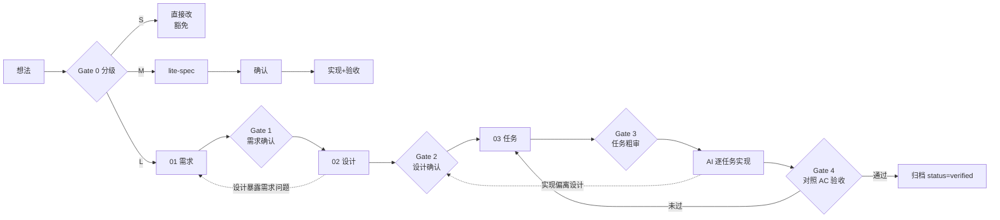

# 开发流程宪章（AI 协作版）

> 本文件定义本仓库的功能开发文档流。**AI 开工前必读**；修改本流程本身需人类确认。

## 1. 开工分级（Gate 0）

每个新需求先分级：**AI 提议级别，人确认**。

| 级别 | 判定标准（满足任一即升级） | 流程 |
|------|---------------------------|------|
| **S 微小** | < 半天工作量；单模块；不改表结构 / 不改接口 / 不引依赖 | 豁免文档流，commit message 写清「做了什么 + 为什么」 |
| **M 中等** | 1~3 天；少量接口或表字段变更；或跨 ≥2 个模块 | 精简流：单文件 spec（用 `templates/00-lite-spec.md`），1 次确认 |
| **L 大型** | > 3 天；新增表 / 新三方依赖 / 新外部服务；或涉及权限、支付、数据迁移 | 完整流：01 → 02 → 03 三文档 + 4 道门禁 |

## 2. 完整流程与门禁



| 门禁 | 通过条件 | 通过标志 |
|------|----------|----------|
| G1 需求确认 | FR 完整；每条 AC 可执行可验证；范围外写清 | 01 的 `status: approved` + 日期 |
| G2 设计确认 | 设计覆盖全部 FR（front-matter `implements` 已列出）；影响面清单完整；关键决策已拍板 | 02 的 `status: approved` |
| G3 任务粗审（轻） | 任务粒度 ≤30 分钟 AI 工作量；顺序与依赖合理 | 03 的 `status: approved` |
| G4 验收 | 对照 01 的 AC 逐条通过；03 的验收记录填写完整 | 03 的 `status: verified`，归档 |

## 3. 铁律（同时写入 constitution 与 CLAUDE.md）

1. **上一道门禁未过，不得开始下一阶段**——AI 发现 status 不是 approved 时必须停下等待。
2. 实现过程中需要偏离已批准的设计 → **停下** → 在 02 的「变更记录」写明偏离点与理由 → 人重新确认（只确认变更点，不重走全流程）。
3. 文档由 AI 起草和维护，人只 Review + 确认。确认方式：口头说“确认”，由 AI 改 status 字段并单独提交一个 `docs(<feature>): approve <doc>` 的 commit。
4. **新增信息优先并入既有文档的既定小节，不新建文档**。文档总数固定为：全局 2 份 + 每个功能 3 份。
5. **文档与代码同库同提交**：文档每次变更（含 status 翻转）随实现一起进 git，防止「文档和代码两张皮」（spec rot）。

## 4. 豁免清单（显式列举，避免每次纠结）

- 缺陷修复（含 hotfix：可先修，事后补一句说明）
- 纯样式 / 文案 / 排版调整
- 不改变行为的重构（重命名、抽函数、挪文件）
- 依赖小版本升级
- 探索性 spike：只需在 `docs/spike/` 留一页结论；若转正为功能，按 M/L 补流程

## 5. 防过重：规模上限

| 文档 | 上限 | 超限的含义 |
|------|------|-----------|
| 01 需求 | ≤ 1 页（5 分钟读完） | 功能该拆分 |
| 02 设计 | ≤ 2 页 | 方案该简化或功能该拆分 |
| 03 任务 | ≤ 12 个任务 | 任务该合并或功能该拆分 |
| lite-spec | ≤ 1 页 | 该升级走完整流 |

- 每月把 `status: verified` 的功能目录移到 `docs/archive/`。
- 人的时间只应花在「确认」上；任何门禁审阅超过 10 分钟，说明文档写得太复杂。

## 6. 目录约定

```
docs/
  workflow.md            ← 本文件（全局，写一次）
  constitution.md        ← 项目宪章（全局，写一次）
  templates/             ← 4 个模板
  feature/<功能名>/       ← 进行中的功能（01/02/03）
  spike/                 ← 探索笔记（可选）
  archive/               ← 已完成功能归档
prompts/                 ← 所有 prompt 文件（带版本 front-matter，视同契约）
evals/<功能名>/           ← 评测集（golden case），AI 功能验收依据
```

## 7. AI/Agent 功能特别条款

涉及 LLM/Agent 的功能，在前面规则之上额外遵守：

1. **AC 必须可评测**：验收标准须引用 `evals/<功能名>/` 下的评测集 + 通过率阈值（如「50 条 golden case，准确率 ≥90%」），禁止只写「回答准确 / 效果好」。
2. **Prompt 与工具定义视同接口契约**：统一放 `prompts/` 目录、带版本号；任何修改至少按 M 级走确认，记入变更记录。
3. **验收必须附评测运行记录**：G4 前跑一次回归评测，结果（评测集版本 / 通过率 / 失败样例）填入 03 的验收记录。
4. **危险动作默认需人确认**：Agent 执行不可逆操作（写删文件、外发请求、支付等）前必须有人工确认节点，除非在 02 中显式豁免。
