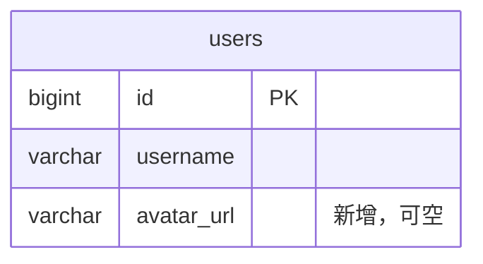
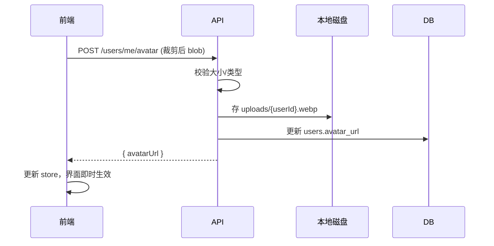

# 技术设计：用户头像上传（示例）

## 1. 方案概述
后端给 users 表加 `avatar_url` 字段并新增上传接口，文件存本地 `uploads/` 目录；前端用 vue-cropperjs 裁剪后 multipart 上传。选本地存储：个人项目量级小，零额外成本与依赖。

## 3. 数据模型

## 4. 接口设计
| 方法 | 路径 | 请求体 | 响应体 | 对应 FR | 备注 |
|------|------|--------|--------|---------|------|
| POST | /api/users/me/avatar | multipart(file) | { avatarUrl } | FR-001 | 限 2MB，校验类型 |
| GET | /api/users/me（已有） | - | 增加 avatarUrl 字段 | FR-002 | 改响应 |

## 5. 核心流程时序

## 6. 前端设计
| 项 | 内容 |
|----|------|
| 路由 | 不变（/profile 内嵌上传弹窗） |
| 组件 | ProfilePage → AvatarUploader（选择/裁剪/预览） |
| 状态 | user store 增加 avatarUrl，上传成功后本地更新 |

## 7. 关键决策
| # | 决策点 | 候选 | 结论 | 理由 |
|---|--------|------|------|------|
| 1 | 存储方式 | OSS / 本地磁盘 | 本地磁盘 | 零成本零依赖，量级小 |
| 2 | 裁剪位置 | 前端 / 后端 | 前端 | 所见即所得，减后端压力 |

## 8. 影响面
| 类型 | 位置 | 改动方式 |
|------|------|----------|
| 表 | users | 加列 avatar_url（新 migration） |
| 后端 | UserController / UserService | 新增上传方法 |
| 前端 | ProfilePage.vue、stores/user.ts | 修改 |

## 9. 风险与回退
| 风险 | 概率 | 应对 / 回退 |
|------|------|-------------|
| 磁盘占满 | 低 | 单文件 ≤2MB；回退 = 删接口 + 回滚列 |

## 变更记录
| 日期 | 变更内容 | 原因 | 确认人 |
|------|----------|------|--------|
| - | - | - | - |
