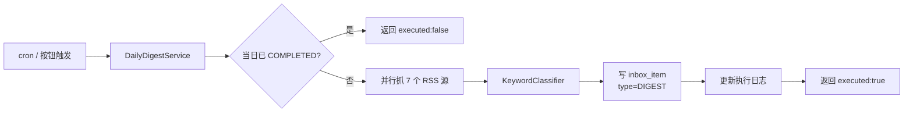
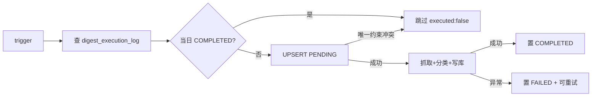

# Daily Digest — 技术深读（AI 篇）

> 面向技术分享 / 面试复盘：聚焦「Daily Digest 功能里**实际生效**的 AI / 智能决策点」。
> 任何"未来可做"的项目都明确标 *Roadmap*，避免混淆。

## 1. 一句话总览

Daily Digest 是一个**基于关键词的轻量文本分类流水线**：用 Spring Boot 并行抓 7 个中文科技 RSS 源，把每篇文章按「标题 + 摘要」做子串匹配，归到 4 个桶里（AI 前沿 / 技术产业 / 财经科技 / 其他），结果落到 Inbox。整个链路里**没有任何 LLM 调用**——"AI" 名头是产品语义，技术上是经典规则系统。

## 2. 架构全景



## 3. 关键词分类器（核心 AI 决策点）

### 3.1 接口设计 — 留好升级口子

```java
// digest/classify/Classifier.java
public interface Classifier {
    DigestCategory classify(Article article);
}
```

```java
// digest/classify/DigestCategory.java
public enum DigestCategory { AI_FRONTIER, TECH_INDUSTRY, FINANCE_TECH, OTHER }
```

**关键设计**：调用方 `DailyDigestService` 注入的是 `Classifier` 接口而非具体类。未来要加 LLM 分类器，只需写一个 `LlmClassifier implements Classifier`，用 `@ConditionalOnProperty` 切换，业务代码零改动——这是**开闭原则（OCP）** 在小项目里的标准应用。

### 3.2 关键词版实现 — 30 行解决问题

```java
// digest/classify/KeywordClassifier.java（核心节选）
@Component
public class KeywordClassifier implements Classifier {
    private final List<String> aiFrontier;     // AI,LLM,GPT,大模型,具身智能,算力...
    private final List<String> techIndustry;   // cloud,kubernetes,鸿蒙,微服务...
    private final List<String> financeTech;    // NVIDIA,TSMC,财报,半导体,投融资...

    @Override
    public DigestCategory classify(Article a) {
        String text = (a.title() + " " + a.summary()).toLowerCase();
        if (matches(text, aiFrontier))   return DigestCategory.AI_FRONTIER;
        if (matches(text, techIndustry)) return DigestCategory.TECH_INDUSTRY;
        if (matches(text, financeTech))  return DigestCategory.FINANCE_TECH;
        return DigestCategory.OTHER;
    }

    private static boolean matches(String text, List<String> keywords) {
        return keywords.stream().anyMatch(k -> text.contains(k.toLowerCase()));
    }
}
```

**讲法**（面试谈 1~2 分钟）：
- 关键词预转小写、文本一次 toLowerCase → 避免 N×M 重复计算
- 优先级即重要度：命中 T0 词（AI）即返回，不再看其他桶
- 关键词列表从 `application.yml` 注入 → 改分类规则不用动代码
- 缺点：无法处理"语义相近但用词不同"的情况（如「苹果自研 AI 芯片」没出现"大模型"三个字）→ 留给 LLM 升级

## 4. RSS 抓取 — 失败隔离 / 并行调度

虽然不是"AI"，但**对系统可靠性影响最大**，常被面试追问：

```java
// digest/fetch/RssFetcherService.java
List<Article> fetchAll() {
    List<CompletableFuture<List<Article>>> futures = sources.stream()
        .map(s -> CompletableFuture.supplyAsync(
            () -> safeFetch(s),  // 每个源独立 try/catch，单源失败返空
            digestExecutor))     // 专用有界线程池：core 8 / max 16 / queue 16
        .toList();
    return futures.stream()
        .map(f -> f.handle((r, ex) -> r == null ? List.of() : r))  // 失败兜底
        .map(CompletableFuture::join)
        .flatMap(List::stream)
        .toList();
}
```

讲法关键词：**Single source of truth（唯一约束）兜底**、**有界线程池防 OOM**、**单源超时 5s 隔离**、**`CompletableFuture.handle` 兜空**。

## 5. 幂等性 — 三层防御



讲法关键词：**应用层 check → DB 唯一约束兜底**，**失败可重跑（FAILED 状态允许 retry）**。

## 6. AI 选型 / 升级路线（Roadmap）

> 这一节是面试的"加分项"——展示对 LLM 工程化落地的认知。

### 6.1 短期：关键词 + Embedding 聚类

- 现状：关键词匹配
- 升级：用 `BAAI/bge-small-zh-v1.5`（约 100MB，本地 CPU 可跑）算 embedding，余弦相似度聚类到 4 个中心
- 取舍：比关键词贵 10×（embedding + 距离计算），但召回显著上升
- 适用：想"无配置自动跟新热点"，但又不想接 LLM API

### 6.2 中期：LLM 分类（核心路径）

- 选型：项目已用 Spring AI 2.0 + OpenAI 兼容协议（见 `application.yml` 的 `spring.ai.openai`）
- 改造点：
  1. 新增 `LlmClassifier implements Classifier`，prompt 结构化输出 `category + confidence`
  2. `@ConditionalOnProperty(name = "app.digest.classifier.impl", havingValue = "llm")` 切换
  3. 成本：每天 ~200 篇 × ~$0.0001/篇 ≈ $0.02/天，月成本 ~$0.6
- 评测（按本仓库工作流 §7 强制要求）：
  - 50 条 golden case + 通过率 ≥85%
  - 评测脚本归 `evals/classifier/`（目录按需建）

### 6.3 长期：智能摘要（目前明确不做）

- 现状：直接取 RSS 自带 description，去 HTML、截断 240 字符
- 升级：用 LLM 重写摘要（多语种、突出结论、约束长度）
- 触发改造点：替换 `articleToJson` 流程里加一步 `LlmSummarizer.summarize(a)`

## 7. 面试常被问的 5 个问题（自检清单）

1. **为什么不直接调 LLM 分类？** —— 成本 + 延迟 + 可解释性。规则系统 1ms 出结果，0 元，错了能立刻改关键词。LLM 是 ~500ms + 钱 + 黑盒。
2. **关键词匹配漏召回怎么办？** —— 同义词词典 + Embedding 兜底；终极方案 LLM，但要做评测。
3. **怎么评估分类器效果？** —— 按工作流 §7：50 条 golden + 准确率阈值。代码改动前先扩评测集。
4. **如果 RSS 源被反爬？** —— 加重试 + User-Agent 轮换 + 退避；再不行换 API。**不能调 LLM 去 parse HTML**（成本/速度都不可接受）。
5. **怎么保证不重复抓？** —— DB 唯一约束 + 失败状态允许重跑 + 重跑前 `deleteByTypeAndDigestDate` 清当日旧条目。

## 8. 涉及的工程能力（面试 Self-Tag）

| 能力 | 在本功能的具体体现 |
|---|---|
| 并发编程 | `CompletableFuture` + 有界线程池 + 失败隔离 |
| 数据库设计 | 唯一约束、JPA 实体扩展、DDL 默认值回填 |
| 设计模式 | 策略模式（`Classifier` 接口）、开闭原则 |
| 错误处理 | 三层防御（应用层/悲观锁/DB 唯一约束）→ 简化为两层后保留唯一约束兜底 |
| 配置外部化 | `app.digest.*` 配置 + `@ConfigurationProperties` record |
| 工程化流程 | Spec-Driven（requirements → design → tasks → G1-G4） |
| 工程权衡 | "AI" 名头下是关键词；预留 LLM 升级路径但不预付成本 |

## 9. 演示建议（面试用）

- **白板画架构图**：3 步流水线（抓→分→存）+ 2 个核心接口（`Classifier`、`RssFetcher`）
- **现场改一个关键词**：改 `application.yml` 的 `classifier.keywords.ai-frontier`，重启验证分类变化（演示"零代码改 AI 规则"）
- **讨论升级路径**：从关键词 → Embedding → LLM 的成本-收益曲线
- **强调"反 AI"取舍**：用规则系统解决的 4 个理由（速度/成本/可解释/可调试）

## 10. 一句话收尾

> 这个项目展示了**"AI 不是什么都要用 LLM"** 的工程判断：90% 的分类场景用规则系统 + 良好的接口设计就能解决，剩下 10% 的复杂语义理解才值得 LLM 出手。
