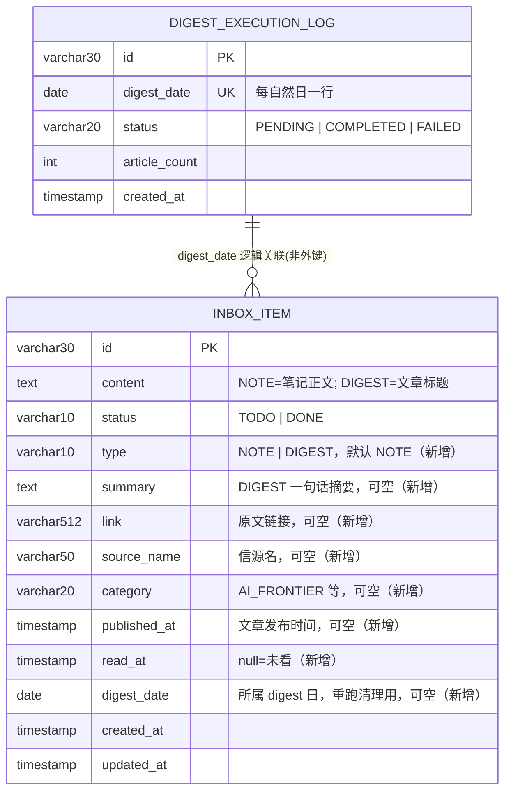
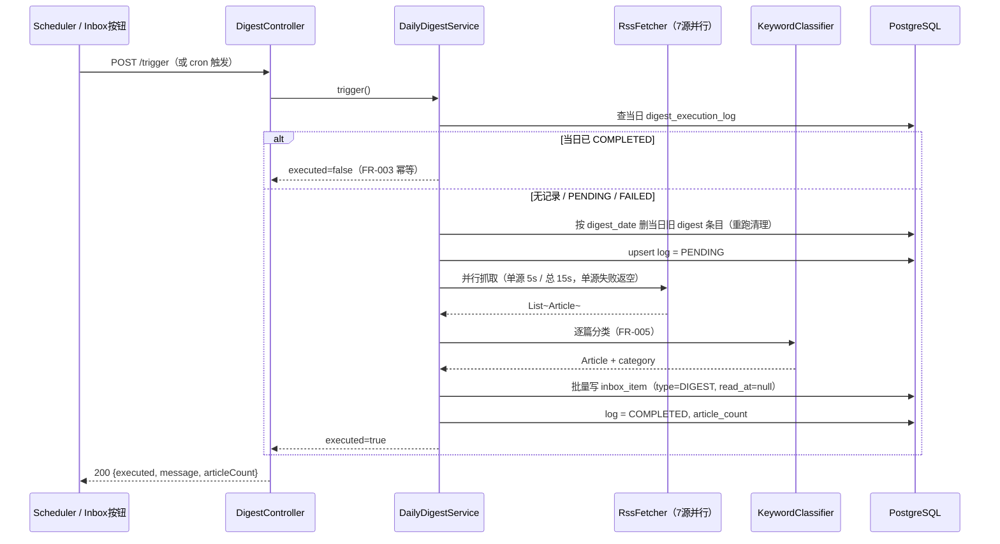

# 技术设计：Daily Digest 每日技术摘要

## 1. 方案概述

复用现有 digest 链路（fetch 并行抓取 / KeywordClassifier / Scheduler 均不动），**输出端从「写 md 文件」改为「写 `inbox_item` 表」**；前端 Inbox 页把 digest 文章当普通条目展示。关键取舍：

1. **digest 文章与手动笔记共用 `inbox_item` 一张表**（`type` 字段区分），不建新表——列表/筛选/搜索/转 Issue 全部复用，代价是表加宽
2. **已读用独立 `read_at` 字段**，不复用 `TODO/DONE`——「看过」和「处理完」是两个维度
3. **失败可重跑**：仅 `COMPLETED` 阻塞当日重跑；重跑前按 `digest_date` 删除当日旧 digest 条目保证内容不重复。放弃旧设计的悲观锁——单实例下数据库唯一约束已是硬保证

## 2. 数据模型

新列由 `ddl-auto: update` 自动添加；`digest_execution_log` 已存在，不变。

## 3. 接口设计

| 方法 | 路径 | 说明 | 对应 FR |
|------|------|------|---------|
| POST | `/api/v1/digest/trigger` | 手动触发；响应 `{executed, message, articleCount}`（已有，不变） | FR-002, FR-003 |
| GET | `/api/inbox` | 列表；返回体新增 `type/summary/link/sourceName/category/publishedAt/readAt`（已有，扩字段） | FR-006 |
| PATCH | `/api/inbox/{id}` | body 增加可选 `read:true` → 置 `readAt=now`（幂等：已有 readAt 不覆盖）（已有，扩展） | FR-007 |
| — | `/api/v1/digest/latest`、`/recent` | **删除**（无落盘文件可读，前端同步移除调用） | — |

定时入口不变：`@Scheduled(cron = app.digest.cron)`，默认 10/12/14/20/22（FR-001）。

## 4. 核心流程

前端交互：Inbox 页头部加「生成今日摘要」按钮（触发中显示 loading，完成后刷新列表）；点击 digest 条目 → 右侧展示标题+摘要+原文链接，同时乐观置已读 + `PATCH {read:true}`。

## 5. 影响面

| 类型 | 位置 | 改动方式 |
|------|------|----------|
| 实体 | `entity/InboxItem.java`、新增 `enums/InboxItemType.java` | 扩 8 个字段 + 新枚举 |
| digest 输出 | `digest/service/DailyDigestService.java` | 输出由写文件改为写 `inbox_item`；重跑清理逻辑 |
| 删除 | `digest/store/DigestInboxWriter.java`、`DigestFileReader.java` | 落盘链路整体删除 |
| 复用不动 | `digest/fetch/*`、`classify/*`、`scheduler/*`、`store/DigestExecutionLog*` | — |
| REST | `axis-agent/digest/controller/DigestController.java` | 删 `/latest`、`/recent` |
| Inbox API | `controller/InboxController.java`、`service/InboxService.java` | PATCH 支持 `read:true` |
| 配置 | `application.yml` | 删 `inbox-dir`；`rss-sources` 换实测可用 7 家 |
| 前端页面 | `pages/index.vue` | 加触发按钮；移除 digest 摘要行；点击条目标记已读 |
| 前端组件 | `InboxItemCard.vue`、`InboxDetailPanel.vue` | digest 样式（来源/分类徽章 + 未读点）、digest 详情（标题+摘要+链接） |
| 前端组件 | `DigestViewer.vue` | 删除 |
| 文档 | `CLAUDE.md` Daily Digest 段 | 实现完成后同步更新 |

## 变更记录

| 日期 | 变更内容 | 原因 |
|------|----------|------|
| 2026-07-21 | 初稿 | G1 通过后编写 |
