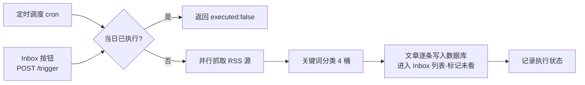

# 需求文档：Daily Digest 每日技术摘要

## 1. 背景与目标

每天手动刷多家科技媒体耗时且易漏，无法沉淀。系统按固定节奏自动聚合中文科技头条，分类后写入数据库、送到 Inbox 页面左侧列表，供每日回顾与知识化。不做此功能：信息源分散，每日技术动态靠人肉维护，灵感捕捉断档。

## 2. 功能需求（FR）

| 编号 | 需求描述 | 优先级 P0/P1/P2 | 验收标准（当…时，系统应…） |
|------|----------|----------------|---------------------------|
| FR-001 | 定时触发：按可配置 cron 自动执行（默认每天 10/12/14/20/22 点） | P0 | 当到达配置时点时，当日摘要生成并送达 Inbox |
| FR-002 | 手动触发：Inbox 页面提供「生成今日摘要」按钮，调用 `POST /api/v1/digest/trigger` | P0 | 当点击按钮时，返回执行结果，新摘要出现在 Inbox 列表 |
| FR-003 | 幂等：同一自然日最多执行一次 | P0 | 当同日第二次触发（定时或手动）时，返回 `executed:false`，不产生新执行 |
| FR-004 | RSS 聚合：从可配置的中文科技源并行抓取头条 | P0 | 当任一单源超时/报错时，其余源文章不受影响；全部失败时记为失败执行 |
| FR-005 | 关键词分类：系统内置 4 个桶（AI前沿 / 技术产业 / 财经科技 / 其他），每桶一组可配置关键词；文章标题或摘要命中哪个桶的词就进哪个桶，都不中进「其他」 | P1 | 当一篇文章标题含「大模型」时，出现在「AI前沿」桶；不含任何关键词时出现在「其他」 |
| FR-006 | 摘要进 Inbox：每次 digest 的文章以条目形式出现在 Inbox 页面左侧列表；点击条目后右侧区域展示标题、一句话摘要与原文链接 | P0 | 当 digest 执行成功后，Inbox 列表出现当日各篇文章条目，点击后右侧展示详情 |
| FR-007 | 已读/未读区分：新到摘要条目为「未看」，点击条目即算「已看」，列表中两种状态可区分 | P1 | 当摘要条目刚进入 Inbox 时带未看标识；点击后标识消除且不再恢复 |

## 3. 范围外（Non-Goals)

- 信源编辑 / 管理界面（**第二期**做；本期信源只能改配置文件）
- CLI / 控制台触发入口
- LLM 智能摘要、ML 分类器（仅预留 `Classifier` 接口，v2 再做）
- 摘要条目转为 Issue / 知识库的流转（走 Inbox 既有能力，本期不改动）（放在二期）
- 多实例分布式锁（单实例部署，幂等由存储层约束兜底）

## 4. 流程示意

## 变更记录

| 日期 | 变更内容 | 原因 |
|------|----------|------|
| 2026-07-21 | 按新工作流重写：实现细节（表结构、线程池、超时参数、错误矩阵）下沉 design.md；本文只留需求与验收 | 旧版 v1 文档超重，不符合 ≤1 页规范 |
| 2026-07-21 | G1 反馈：FR-002 增加 Inbox 触发按钮；FR-005 通俗化重写；新增 FR-008/FR-009（摘要进 Inbox + 已读区分）；前端不再整体排除，信源管理明确放第二期 | 用户 G1 审阅意见 |
| 2026-07-21 | G1 反馈：FR-009 判定方式定为「点击即看过」；FR-008 明确点击后右侧区域展示详情（左右分栏布局） | 用户 G1 审阅意见 |
| 2026-07-21 | cron 确认沿用 10/12/14/20/22；删除「latest 状态查询」（用户不需要），FR-008/009 顺移为 FR-007/008；信源实测：机器之心返回 HTML 反爬页、虎嗅连接超时、极客公园不可达、品玩 404、cnBeta 重定向循环，均不可用 | 用户 G1 审阅意见 + 本机 curl 实测 |
| 2026-07-21 | 砍掉落盘文件：输出仅数据库 + Inbox 列表，原 FR-006 删除，FR-007/008 顺移为 FR-006/007；信源定为 7 家：36氪 / InfoQ / 雷锋网 / 钛媒体 / IT之家 / 开源中国 / 少数派 | 用户 G1 审阅意见 |
