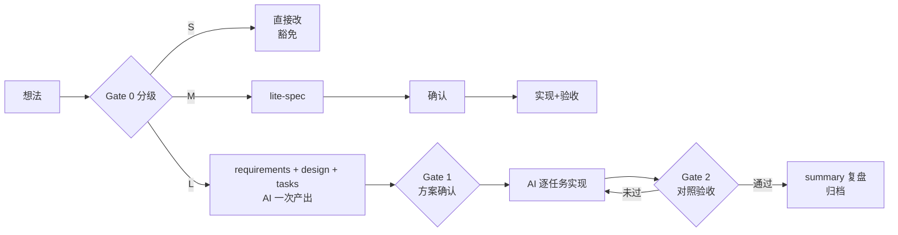

# 开发流程宪章（AI 协作版）

> 本文件定义本仓库的功能开发文档流。**AI 开工前必读**；修改本流程本身需用户确认。

## 1. 开工分级（Gate 0）

每个新需求先分级：**AI 提议级别，用户确认**。

| 级别 | 判定标准（满足任一即升级） | 流程 |
|------|---------------------------|------|
| **S 微小** | < 半天工作量；单模块；不改表结构 / 不改接口 / 不引依赖 | 豁免文档流，commit message 写清「做了什么 + 为什么」 |
| **M 中等** | 1~3 天；少量接口或表字段变更；或跨 ≥2 个模块 | 精简流：单文件 `lite-spec.md`，1 次确认 |
| **L 大型** | > 3 天；新增表 / 新三方依赖 / 新外部服务；或涉及权限、数据迁移 | 完整流：requirements + design + tasks 一次产出 + 2 道门禁 |

## 2. 完整流程与门禁



| 门禁 | 通过条件 | 通过标志 |
|------|----------|----------|
| G1 方案确认 | 需求：FR 完整、每条验收标准可执行可验证、范围外写清、无未决问题。设计：覆盖全部 FR（front-matter `implements` 已列出）、影响面清单完整、关键决策已拍板。任务：粒度 ≤30 分钟 AI 工作量、顺序与依赖合理。**逐字审决策层，细节层按需抽查（见第 5 节）** | requirements / design / tasks 三份 `status` 一次置 `approved` |
| G2 验收 | 对照验收标准逐条通过；tasks.md 验收记录填写完整 | tasks.md `status: verified` → 写 summary.md 后归档 |

## 3. 铁律

1. **G1 未过，不得开始实现**——AI 一次产出三份文档、用户一次确认；任一 status 不是 approved 时必须停下等待。
2. 实现过程中需要偏离已批准的文档 → **停下** → 在对应文档「变更记录」写明偏离点与理由 → 用户重新确认（只确认变更点，不重走全流程）。
3. 文档由 AI 起草和维护，用户只 Review + 确认。确认方式：用户说“确认”，由 AI 改 status 字段并随代码一起提交。
4. **新增信息优先并入既有文档的既定小节，不新建文档**。文档总数固定：每个功能 4 份（M 级 1 份）。
5. **文档与代码同库同提交**：文档每次变更（含 status 翻转）随实现一起进 git，防止「文档和代码两张皮」（spec rot）。

## 4. 豁免清单（显式列举，避免每次纠结）

- 缺陷修复（含 hotfix：可先修，事后补一句说明）
- 纯样式 / 文案 / 排版调整
- 不改变行为的重构（重命名、抽函数、挪文件）
- 依赖小版本升级
- 探索性 spike：只需在 `docs/spike/` 留一页结论；若转正为功能，按 M/L 补流程

## 5. 防过重：决策层 / 细节层分层

requirements / design 分两层，以 `---` + 细节层标注分隔：

- **决策层（硬上限 1 页，5 分钟读完）**：用户 G1 逐字审的部分——目标、FR 清单（每条一行可验证验收）、关键决策与取舍理由、范围外、影响面。超限：优先拆功能，或把展开内容下沉到细节层。
- **细节层（不设上限）**：写给实现用的——接口 schema、数据示例、边界情况、状态机、UI 交互细节、逐条 FR 展开验收。标准只有一个：实现时不再有歧义。用户审阅可选、按需抽查；抽查发现歧义视为文档缺陷，打回重写。
- **格式不强制表格/Mermaid**：表格只用于可枚举事实（字段、端点、状态值）；逻辑、示例、取舍理由用散文或代码块。

其余上限：tasks ≤ 12 个任务（超限该合并或拆功能）。

- **summary / lite-spec 不设页数上限**：欢迎多写，但必须保证决策层 1 页、5~10 分钟可读完——层次清晰、可视化优先（表格/Mermaid/代码块各得其所）；技术背景、知识点科普、实现细节一律下沉到细节层或文末附录，并标注「审阅可选」。可读性差的冗长文档视为缺陷，打回重写。

- `status: verified` 且 summary 写完的功能目录，定期移到 `docs/archive/`。
- 用户的时间只应花在「确认」上；决策层审阅超过 10 分钟，说明决策层写得太复杂。

## 6. 目录约定

```
docs/
  workflow.md            ← 本文件（全局，写一次）
  feature/
    _template/           ← 模板：lite-spec / requirements / design / tasks / summary
    <功能名>/             ← 进行中的功能（M 级只有 lite-spec.md）
  spike/                 ← 探索笔记（可选）
  archive/               ← 已完成功能归档
```

新功能起步：`cp -r docs/feature/_template docs/feature/<功能名>`，按级别删掉用不到的模板。

## 7. AI/Agent 功能特别条款

涉及 LLM/Agent 的功能，在前面规则之上额外遵守：

1. **验收标准必须可评测**：引用评测集 + 通过率阈值（如「50 条 golden case，准确率 ≥90%」），禁止只写「回答准确 / 效果好」。
2. **Prompt 与工具定义视同接口契约**：任何修改至少按 M 级走确认，记入变更记录。
3. **危险动作默认需人确认**：Agent 执行不可逆操作（写删文件、外发请求等）前必须有人工确认节点，除非在 design.md 中显式豁免。

> `prompts/` 与 `evals/` 目录在第一个 AI 功能真正需要时再建，结构届时按本条原则确定。
