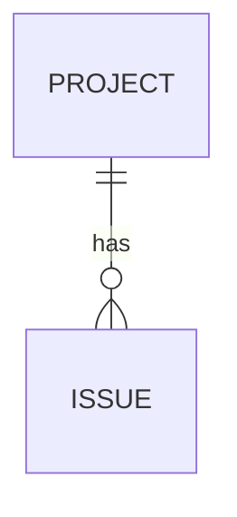
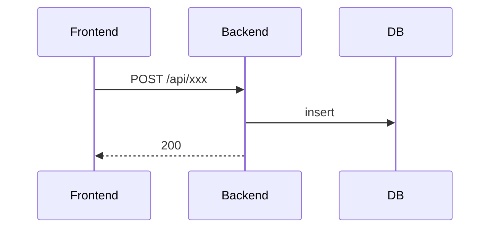

# 技术设计：<功能名>

## 1. 方案概述

<!-- ≤5 行：怎么做 + 关键取舍（为什么选 A 不选 B） -->

## 2. 数据模型

<!-- 无表结构变更则写「无」并删除本节 -->

## 3. 接口设计

| 方法 | 路径 | 说明 | 对应 FR |
|------|------|------|---------|
| POST | /api/xxx | | FR-001 |

<!-- 无 API 变更则删除本节 -->

## 4. 核心流程

## 5. 影响面

<!-- 会被改动或受影响的已有文件/表/接口，供 G2 评估风险 -->

| 类型 | 位置 | 改动方式 |
|------|------|----------|
| | | |

## 6. AI 设计（仅 AI/Agent 功能填写，否则删除本节）

<!-- prompt 要点、工具清单（含副作用/是否需人确认）、护栏与降级、max 步数；验收评测方式见 requirements -->

## 变更记录

| 日期 | 变更内容 | 原因 |
|------|----------|------|
