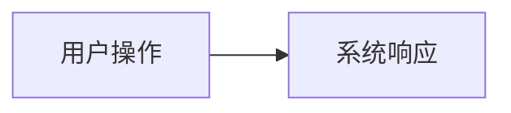

# 需求文档：<功能名>

## 1. 背景与目标

<!-- ≤3 行：解决什么痛点？什么场景下触发？不做会怎样？ -->

## 2. 功能需求（FR）

| 编号 | 需求描述 | 优先级 P0/P1/P2 | 验收标准（当…时，系统应…） |
|------|----------|----------------|---------------------------|
| FR-001 | | P0 | |

## 3. 范围外（Non-Goals）

<!-- 明确不做什么，防止 scope creep -->

## 4. 流程示意（可选）

## 5. 待确认问题

<!-- 有未决项不许过 G1；无则删除本节 -->

- [ ]

## 变更记录

| 日期 | 变更内容 | 原因 |
|------|----------|------|
