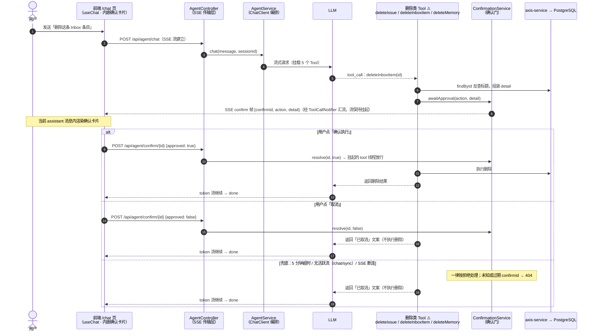

# 精简规格：Agent 危险操作 Human-in-the-loop 确认（M 级）

## 1. 需求

背景：AGENTS.md 写明「Agent 执行不可逆操作前默认需要人工确认节点」，但代码未实现——LLM 一句 tool call 就能删 Issue/Inbox 条目/长期记忆。本次实现「规划-确认-执行」的 Agent 安全模式：删除类 tool 被调用时不直接执行，SSE 流中插入确认帧挂起，前端确认回调后才真正执行。

已与用户对齐的决策：

- **范围**：仅删除类 3 个 tool（`deleteIssue` / `deleteInboxItem` / `deleteMemory`）；创建/更新可逆性高，不拦截
- **挂起方式**：挂起当前 SSE 流（tool 执行线程阻塞等待确认），确认后继续生成；不中断重发
- **UI**：消息流内嵌确认卡片（非模态弹窗），与 tool 调用记录并列

| 编号 | FR | 验收标准（当…时，系统应…） |
|------|-----|---------------------------|
| FR-001 | 3 个删除 tool 接入确认门：触发时发 `{"type":"confirm","confirmId","action","detail"}` SSE 帧并挂起，不直接删 | 用户在卡片点「确认」前，DB 记录仍在；点「确认」后删除生效、流继续生成 |
| FR-002 | 确认回调 `POST /api/agent/confirm/{confirmId}`，body `{"approved": bool}` | 批准→挂起线程放行执行；拒绝→tool 返回取消文案给 LLM，不执行删除；未知/过期 id 返回 404 |
| FR-003 | 超时与无流兜底 | 挂起 5 分钟未确认 → 自动视为拒绝；无活跃对话流（`/chat/sync` 等）调危险 tool → 立即拒绝并返回说明文案 |
| FR-004 | 确认详情可读：detail 含目标对象标题/内容摘要，不是裸 UUID | 卡片文案如「删除 Issue：标题xxx」；`InboxService` 补 `findById`（对齐 `IssueService.findById`） |
| FR-005 | 前端内嵌确认卡片：confirm 帧 → 当前 assistant 消息内出现卡片（动作 + 详情 + 确认/取消按钮） | 点击后 POST 回调、卡片消失、流继续；流结束/异常时卡片被清理不残留 |
| FR-006 | 断连兜底：SSE 流结束（含客户端断开）时取消所有挂起确认 | 挂起中的确认按拒绝放行（tool 返回取消文案），不遗留悬挂 future |
| FR-007 | 单测覆盖确认门与 tool 拦截 | `ConfirmationService` 批准/拒绝/超时/无流/未知 id；3 个 tool 批准执行、拒绝不执行；`mvn test` 全绿 |

**范围外**：更新/取消类状态变更拦截；「本会话不再询问」记忆选项；确认记录持久化审计；`expandPrd`（只挂 KnowledgeTool 只读方法，无危险操作）。

## 2. 方案要点

- **ChatEvent 增加 `Confirm(confirmId, action, detail)` record**（sealed 接口 → Controller 的 pattern matching switch 编译期强制补帧映射 `{"type":"confirm",...}`）。
- **新增 `ConfirmationService`**（axis-agent `com.esmile.axis.ai`）：`ConcurrentHashMap<confirmId, CompletableFuture<Boolean>>` 存挂起；`awaitApproval(action, detail)` 发 confirm 事件后 `future.get(5min)` 阻塞等待；`resolve(id, approved)` 完成 future（未知 id 返回 false）；`rejectAllPending()` 流结束时全量按拒绝放行。测试用包私有构造器注入短超时。
- **`ToolCallNotifier` 扩展**：`emit` 泛化为接受 `ChatEvent`（保留 `emit(String)` 便捷方法），新增 `isActive()` 供确认门判断有无活跃流。
- **挂起链路**：tool 方法（Spring AI 调用线程）→ `awaitApproval` 阻塞 → 前端 `POST /api/agent/confirm/{id}`（独立 Tomcat 线程）→ future 完成 → tool 继续/放弃 → token 流继续。单用户应用，阻塞可接受。
- **无流自动拒绝**：`awaitApproval` 发现 `!notifier.isActive()` 立即返回 false（`/chat/sync` 无 UI 无法确认，fail-fast 不误删）。
- **`AgentService.chat` 的 `doFinally`** 增加 `confirmationService.rejectAllPending()`（正常结束时 map 本就为空，仅断连时生效）。
- **tool 改造**（3 处同构）：先查对象组 detail → `awaitApproval` false 则返回「用户未确认/超时，已取消」文案 → true 才调 service.delete。`@Tool` description 补「需用户确认」提示 LLM。
- **前端**：`useChat` 增 `pendingConfirm` state + `respondConfirm(approved)`（`$fetch` POST，卡片乐观消失）；`chat.vue` 在 streaming 的 assistant 消息块内渲染确认卡片（AlertTriangle 图标 + destructive「确认执行」+「取消」）；`send()` 的 finally 清理 `pendingConfirm`。

## 3. 任务

| ✓ | 任务 | 验收点 | Commit |
|---|------|--------|--------|
| ☑ | `ChatEvent.Confirm` + `ToolCallNotifier` 泛化 + `ConfirmationService` + 单测 | 批准/拒绝/超时/无流/未知 id/rejectAllPending 6 用例全绿 ✅ | 待回填 |
| ☑ | 3 个 delete tool 接确认门 + `InboxService.findById` + tool 单测 | 批准才删、拒绝不删、detail 含标题（6 用例全绿）✅ | 待回填 |
| ☑ | `POST /api/agent/confirm/{id}` 端点 + Controller 帧映射 + `AgentService` doFinally 兜底 | E2E：404 语义正确；`mvn test` 全绿 ✅ | 待回填 |
| ☑ | 前端 `useChat` confirm 帧 + 内嵌确认卡片 | E2E 验证：确认/取消两路径 + `npm run build` 通过 ✅ | 待回填 |
| ☑ | roadmap 勾选 + AGENTS.md 同步 + 回填 commit hash | 文档与代码一致（hash 提交后回填）✅ | 待回填 |

## 4. 验收记录

| FR | 结果 | 验证方式 |
|----|------|----------|
| FR-001 | 通过 | E2E（7790 端口真实 LLM）：挂起期间条目仍在 DB；批准后 SSE 流继续、条目被删除 |
| FR-002 | 通过 | E2E：`approved:false` → tool 返回取消文案、条目保留；`approved:true` → 删除生效；未知 id → 404 |
| FR-003 | 通过 | 单测 `awaitApproval_timeout_returnsFalse`（200ms 短超时注入）/ `awaitApproval_noActiveStream_returnsFalseImmediately` |
| FR-004 | 通过 | E2E confirm 帧 detail 实测为「内容：E2E 确认门测试条目——待删除」；tool 单测断言 detail 含标题/内容 |
| FR-005 | 通过 | `npm run build` 通过；卡片随 confirm 帧出现、回调后消失、finally 清理（前端无测试基建，实现路径与 E2E 帧格式已核对） |
| FR-006 | 通过 | 单测 `rejectAllPending_pendingConfirmation_releasesAsRejected`；`AgentService.chat` doFinally 接线 |
| FR-007 | 通过 | `mvn test` 全绿：ConfirmationServiceTest 6 + tool 测试 6，axis-service 既有套件不回归 |

## 5. 架构图

设计要点：

- **挂起式而非中断重发**：tool 结果必须回到 LLM 上下文才能继续生成，挂起当前 SSE 流是唯一不打断对话环路的做法；单用户应用阻塞一条请求线程（≤5min）代价可接受
- **只拦删除类**：创建/更新可逆性高不值得打断用户；确认门默认拒绝（fail-closed）——任何异常路径（超时/断连/无流）的结果都是「不执行」
- **confirmId 一次性 + 5 分钟过期**：Future 用后即从 Map 移除，重复/迟到回调返回 404，防重放、防线程悬挂
- **detail 反查标题**：确认卡片展示「删除 Issue：修复登录 bug」而非裸 UUID，用户确认时知道自己在删什么

## 6. 原理速懂（Agent 新手向）

**LLM 从不亲自执行任何操作。** 它只会输出文本；「调工具」是输出一段结构化文本（`tool_calls`：方法名 + JSON 参数）。真正干活的是 Spring AI 藏在 jar 里的循环（`DefaultToolCallingManager`）：解析 tool_calls → 按 name 匹配 `@Tool` 注解的 Java 方法（`MethodToolCallback`，默认 key 就是方法名）→ 反射调用拿返回值 → 把结果追加进对话历史 → 再调 LLM，直到模型返回纯文本。这个环路在我们代码里看不到，`chatClient.prompt().tools(...).stream()` 内部全包了。

**「危险」是人圈定的，不是 LLM 判断的。** 规格阶段圈定 3 个删除方法为危险操作；`@Tool` description 里的「需用户确认」只是告知 LLM 行为变了，真正的拦截在 Java 侧——LLM 碰不到删除逻辑，只能「申请」。

**确认门是挂起，不是拒绝。** tool 方法必须返回结果给框架，否则对话环路会断。所以 `awaitApproval` 让 tool 线程就地睡眠（`future.get(5min)`），同时经 `ToolCallNotifier` 往 SSE 流发 confirm 帧（token 流暂停，但工具事件这条合并进来的支流还通着）。

**空 `CompletableFuture` 是跨线程交接点。** 空就是设计意图——「稍后有人放值进来」。类比快递柜：`pending` Map 是柜子，confirmId 是取件码；tool 线程是取件人，占个空格子后睡前等；用户点按钮后 `/api/agent/confirm/{id}` 这个快递员线程按取件码找到格子，`complete(approved)` 放值，取件人瞬间被唤醒继续走。

**confirm 接口不调 LLM，因为上下文从未丢失。** `/chat` 的 SSE 请求在挂起期间一直开着，对话历史、待完成的 tool_call 都活在被暂停线程的调用栈里。confirm 只是「放行」：tool 方法一 return，框架循环在原线程里自动发起下一轮 LLM 调用，token 继续往老连接里写。用户确认走「带外」（独立 HTTP 请求），LLM 对话走「带内」（一条未中断的 SSE 流），CompletableFuture 是把两条通道缝起来的线。

**fail-closed**：超时 / 无活跃流 / 断连 / 未知 id，任何异常路径的结果都是「不执行」。

## 变更记录

| 日期 | 变更内容 | 原因 |
|------|----------|------|
| 2026-08-16 | `ConfirmationService` 单参构造器加 `@Autowired` 显式标注 | E2E 启动发现的缺陷：双构造器（生产 + 测试注入短超时）下 Spring 无法推断注入点，报 NoSuchMethodException 启动失败 |
| 2026-08-17 | code-review 后修复：① `InboxService.findById` 补 `@Transactional(readOnly = true)`（对齐 `IssueService.findById`，FR-004 对齐只做了一半）；② `ChatHistoryService` 补 `findMemoryById`，`MemoryTool` 不再手写 listMemories 过滤（Feature Envy）；③ `ConfirmationService` 加 `@Slf4j`，超时/中断/异常/无流路径留日志（原来静默吞异常，5 分钟超时零痕迹不利排障） | 提交前 code-review 两轴（Standards/Spec）发现项 |
| 2026-08-17 | 登记两个已知边界，不修：① 客户端在确认挂起期间断连时，tool 线程按拒绝放行后 Spring AI 环路会再发起一次无观众的 LLM 调用（token 丢弃）——单用户应用代价可接受，框架级取消成本高；② LLM 幻觉出不存在 id 时 `findById`/`findMemoryById` 直接抛异常快失败（与既有 update 类 tool 一致），不进确认门——结果同样是不执行，符合 fail-closed | 同上，Spec 轴 (c) 类发现，评估后决定保持现状 |
