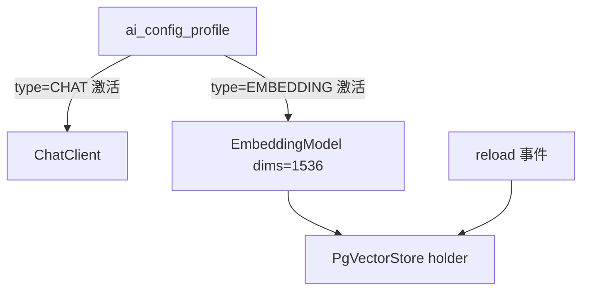

# 精简规格：AI 配置档案分类型（CHAT / EMBEDDING）（M+ 级）

## 1. 需求

chat 模型与 embedding 模型不同 provider（如 chat=Kimi、embedding=智谱），当前"全局激活一个档案、embedding 共用其 key/endpoint"的模型不成立。档案按用途分类，每类独立管理、独立激活，未来可扩展更多类型。设计已与用户确认（2026-08-06 brainstorming：单表+类型枚举；顺手修 B-004 热重建；维度策略见 FR-006）。

| 编号 | FR | 验收标准（当…时，系统应…） |
|------|-----|---------------------------|
| FR-001 | 档案分类型 | 当创建/激活档案时带类型（CHAT/EMBEDDING）时，每类最多一个激活，跨类操作互不影响 |
| FR-002 | embedding 独立解析 | 当存在激活的 EMBEDDING 档案时，`getEmbeddingModel()` 用其 key/endpoint/model；无则走 env 兜底（`AI_API_KEY`/`AI_BASE_URL` + `AI_EMBEDDING_MODEL`） |
| FR-003 | store 热重建（B-004） | 当 embedding 配置变化（切换/更新 EMBEDDING 档案触发 reload 事件）时，PgVectorStore 不重启即重建生效；重建失败降级关键词检索 + WARN |
| FR-004 | test 端点分类型 | 当测试 EMBEDDING 档案时，用真实 embed 调用验证（能暴露 provider 响应不兼容，如缺 `usage`）；CHAT 档案维持 pong 测试 |
| FR-005 | Settings 双分区 | 当打开 Settings 时，Chat Models / Embedding Models 两区各自列表+Add，表单按区固定类型 |
| FR-006 | 维度固定 1536 | 当发出 embedding 请求时，显式带 `dimensions=1536`（对齐 `vector_store` 表；OpenAI 3-small 默认即 1536，智谱 embedding-3 支持 256–2048 自定义——见变更记录） |

**范围外**：更多档案类型（未来加枚举值即可）；维度 UI 可配；B-001/B-002/B-005/B-006。

## 2. 方案要点

`ai_config_profile` 加 `type VARCHAR(20) NOT NULL DEFAULT 'CHAT'`（存量自动归 CHAT），同时**撤销** `embedding_model` 列（前一日特性被本方案取代，EMBEDDING 档案的 `model` 字段即 embedding 模型名）。解析双路：chat=激活 CHAT 档案→env；embedding=激活 EMBEDDING 档案→env。`reload()` 发 Spring 事件，`KnowledgeSearchConfig` 改 volatile holder 持有 store、监听事件重建，search/index 服务每次调用取当前 store。`getEmbeddingModel()` 构建 options 时固定 `dimensions(1536)`。

## 3. 任务

| ✓ | 任务 | 验收点 | Commit |
|---|------|--------|--------|
| ☑ | T-001 数据模型：`type` 列 + 撤 `embedding_model` 列（V1__init.sql + 运行库 ALTER + 实体 `AiProfileType` 枚举） | validate 通过 | 5bac4e2 |
| ☑ | T-002 `AiConfigService`：双路解析、CRUD/激活按类型隔离、test 分类型、reload 发 `AiConfigReloadedEvent`；撤 ResolvedConfig.embeddingModel/resolveEmbeddingModel | 新单测覆盖 | 5bac4e2 |
| ☑ | T-003 B-004：holder + 事件监听重建 + 服务动态取 store | 切 embedding 档案不重启生效 | 5bac4e2 |
| ☑ | T-004 Controller/DTO：`type` 进出，撤 embeddingModel | 接口实测 | 5bac4e2 |
| ☑ | T-005 Settings 双分区 UI | 截图验证 | 5bac4e2 |
| ☑ | T-006 测试修复+新增，`mvn test` 全绿 | 165/165 全绿 | 5bac4e2 |
| ☑ | T-007 文档：AGENTS.md 改写 embedding 节、昨日 lite-spec 变更记录、tasks.md 关 B-004 | | 5bac4e2 |
| ☑ | T-008 端到端验收（临时端口实测）+ 填验收记录 | FR-001~006 全过 | 5bac4e2 |

## 4. 验收记录

| FR | 结果 | 验证方式 |
|----|------|----------|
| FR-001 | ✓ | 实测：kimi(CHAT) 与 tmp-zhipu(EMBEDDING) 同时 isActive=true，互不影响；`activateProfile_otherTypeNotAffected` 单测 |
| FR-002 | ✓ | 单测 `resolveEmbeddingConfig_activeEmbeddingProfile_usesDb` / `_noEmbeddingProfile_fallsBackToEnv` |
| FR-003 | ✓ | 实测日志：创建/删除 EMBEDDING 档案后 `knowledge.vector.rebuild` → `knowledge.vector.enabled`，未重启；`PgVectorStoreHolderTest.rebuild_afterConfigFixed_storeBecomesAvailable` |
| FR-004 | ✓ | 实测：EMBEDDING 档案（假 key）test 返回智谱真实 401「令牌已过期或验证不正确」——证明走了真实 embed 调用且 endpoint 路径正确 |
| FR-005 | ✓ | headless Chrome 截图：Chat/Embedding 双分区渲染正确，Add Embedding Model 弹窗带类型化 placeholder |
| FR-006 | ✓ | `buildEmbeddingModel` 固定 `dimensions(1536)`；单测覆盖解析链，`mvn test` 165/165 全绿 |

## 变更记录

| 日期 | 变更内容 | 原因 |
|------|----------|------|
| 2026-08-06 | 新增 FR-006（请求固定 `dimensions=1536`）：相对已批准的"维度不处理"有偏离 | 用户提供候选模型智谱 embedding-3 默认 2048 维（256–2048 可自定义），不显式指定则与 `vector(1536)` 表不匹配；固定 1536 对 OpenAI 3-small 无副作用，数据模型不变 |
