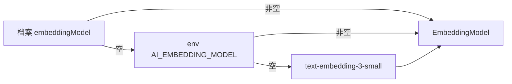

# 精简规格：AI 档案支持配置 Embedding 模型（M 级）

## 1. 需求

embedding 模型名目前只有全局环境变量 `AI_EMBEDDING_MODEL`（默认 `text-embedding-3-small`），不随档案走。多服务商切换场景下各家 embedding 模型名不同，需要与 chat 模型一样随 AI 档案配置。设计已与用户确认（2026-08-05 brainstorming）。

| 编号 | FR | 验收标准（当…时，系统应…） |
|------|-----|---------------------------|
| FR-001 | 档案可配置 embedding 模型名 | 当档案填写了 embeddingModel 并被激活时，`AiConfigService.getEmbeddingModel()` 使用该值 |
| FR-002 | 留空兜底 | 当档案 embeddingModel 为空时，依次取 `AI_EMBEDDING_MODEL` 环境变量 → `text-embedding-3-small` |
| FR-003 | Settings 可编辑 | 当在 Settings 档案表单填写/修改 embedding 模型（可选）并保存时，后端持久化并随档案生效 |

**范围外**：embedding 维度校验与 `vector_store` 重建（用户自行保证 1536 维）；B-004 热切换刷新 PgVectorStore（embedding 模型变更维持"重启后生效"现状）。

## 2. 方案要点

模型名取值顺序：档案 `embeddingModel`（非空）→ `AI_EMBEDDING_MODEL` env → `text-embedding-3-small`；key/base-url 仍用档案的（现状不变）。表结构变更：`ai_config_profile` 加 `embedding_model VARCHAR(100) NULL`——改 `V1__init.sql`（按约定 dev 期重建本地库；对当前运行库执行等价 `ALTER TABLE` 避免丢数据）。

## 3. 任务

| ✓ | 任务 | 验收点 | Commit |
|---|------|--------|--------|
| ☑ | T-001 `V1__init.sql` + `AiConfigProfile` + ConfigController DTO 加 `embeddingModel`；运行库 `ALTER TABLE` | 编译通过；建/改档案接口带得上字段 | 待提交 |
| ☑ | T-002 `AiConfigService.getEmbeddingModel()` 三级取值 + 单测（档案值/空走 env/全空走默认） | 新增单测全绿 | 待提交 |
| ☑ | T-003 Settings 档案表单加「Embedding 模型」可选输入框（placeholder `text-embedding-3-small`） | UI 截图验证：填写/留空两种保存均正常 | 待提交 |
| ☑ | T-004 AGENTS.md 补档案字段优先级；`mvn test -pl axis-service` 全绿 | FR-001~003 验收记录填齐 | 待提交 |

## 4. 验收记录

| FR | 结果 | 验证方式 |
|----|------|----------|
| FR-001 | ✓ | 临时端口 7799 新 jar 实测：POST 带 `embeddingModel` 建档，响应与 DB 均持久化该值；`AiConfigServiceTest.load_dbProfile_carriesEmbeddingModel` |
| FR-002 | ✓ | PUT 空串归一化为 `null`（响应 `"embeddingModel":null`）；单测覆盖 blank/null → env 兜底 |
| FR-003 | ✓ | headless Chrome 截图：Edit Configuration 弹窗渲染 Embedding Model 输入框与提示文案；`mvn test` 160/160 全绿 |

## 变更记录

| 日期 | 变更内容 | 原因 |
|------|----------|------|
| 2026-08-06 | 本特性被 `ai-config-typed-profiles` 取代：档案改为按用途类型化（CHAT/EMBEDDING 各自独立激活），`embedding_model` 列已撤销，EMBEDDING 档案的 `model` 字段即 embedding 模型名 | 用户实际场景：chat 与 embedding 不同 provider，"共用档案 key/endpoint"前提不成立 |