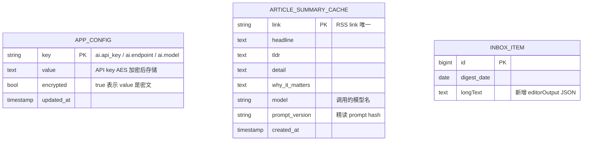
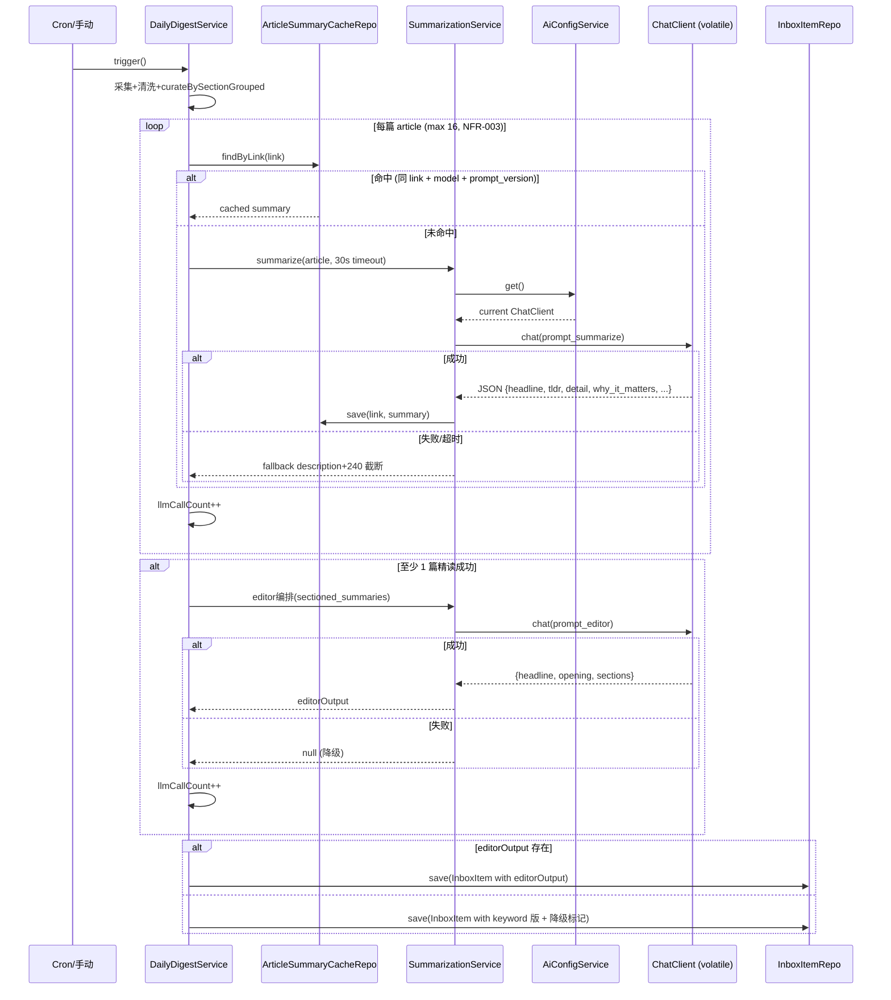
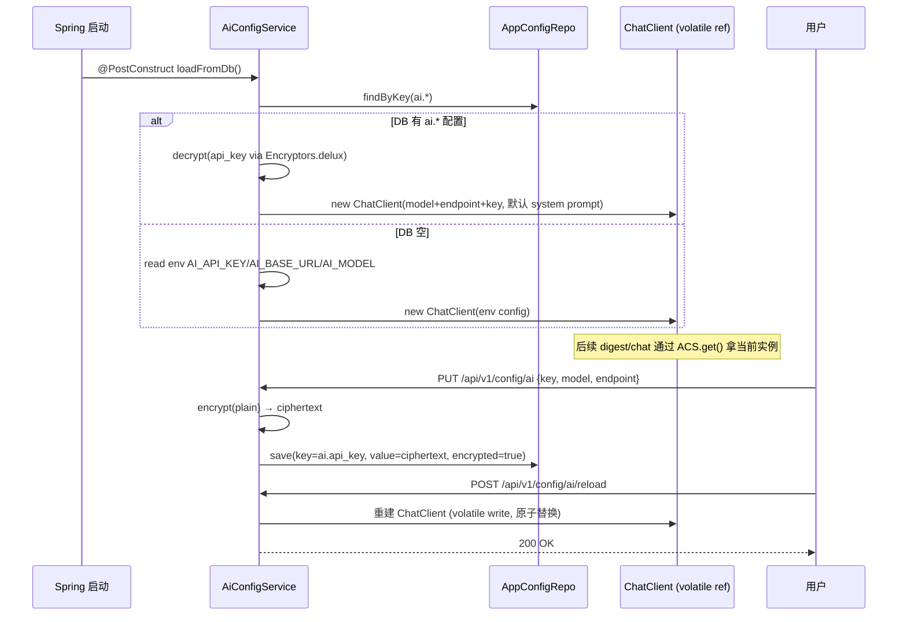

# 技术设计：信息摘要 2.0

## 1. 方案概述

新增 2 张表（`app_config` KV 配置 / `article_summary_cache` LLM 结果缓存），新增 `AiConfigService` 管理 ChatClient 生命周期（DB 优先 + 加密 + 热更新），新增 `SummarizationService` 实现精读+主编两步 LLM 调用；改造 `DailyDigestService` 串联采集→缓存查询→精读→主编→写 inbox，单篇/整批失败均有降级路径。前端 `settings.vue` 从 localStorage 改写后端，配套测连/来源显示。**关键取舍：ChatClient 抽成 `AiConfigService` 单例持有 `volatile` 引用，digest 与 chat agent 共用同一实例**——保证一处配置、全局生效，避免两套配置漂移。

## 2. 数据模型



## 3. 接口设计

| 方法 | 路径 | 说明 | 对应 FR |
|------|------|------|---------|
| GET  | `/api/v1/config/ai`     | 读当前 AI 配置（API key 仅返回 `***` 掩码） | FR-001 |
| PUT  | `/api/v1/config/ai`     | 写 AI 配置（加密入库；入参明文） | FR-001 |
| POST | `/api/v1/config/ai/reload` | 热更新：重建 `volatile ChatClient` | FR-001 |
| POST | `/api/v1/config/ai/test` | 测连：用当前配置调一次简单 prompt，返回成功/失败 | FR-004 |

## 4. 核心流程

### 4.1 digest 触发后的 LLM 链路（含降级）



### 4.2 配置加载与热更新



## 5. 影响面

| 类型 | 位置 | 改动方式 |
|------|------|----------|
| 新表 | `app_config` | JPA entity + repository；`ddl-auto=update` 建表；初始无行 |
| 新表 | `article_summary_cache` | 同上；唯一约束在 `link` |
| 新文件 | `config/AiConfigService.java` | 启动加载 + encrypt/decrypt + reload() + get()；持 `volatile ChatClient` |
| 新文件 | `digest/summarize/SummarizationService.java` | 精读 + 主编；30s timeout；JSON 解析失败重试 1 次 |
| 新文件 | `controller/ConfigController.java` | 4 个端点（GET/PUT/POST reload/POST test） |
| 修改 | `service/DailyDigestService.java` | 注入 `SummarizationService` + `AiConfigService`；`curateBySection` 拆出 `curateBySectionGrouped`（返回 `Map<DigestCategory, List<Article>>` 保留顺序） |
| 修改 | `store/DigestExecutionLog.java` | 加 `llmCallCount` 字段（NFR-003） |
| 修改 | `config/AiConfig.java` | 删除 `chatClient` `@Bean`；chat agent 改为 `aiConfigService.get()` 获取 |
| 修改 | `pages/settings.vue` | 写 localStorage → 写后端；加测连按钮、来源显示、立即生效按钮 |
| 新增 | `docs/feature/digest-2.0/evals/summarize-golden.jsonl` | 20 条真实文章 + 期望 JSON 输出 |
| 新增 | `docs/feature/digest-2.0/evals/editor-judge.md` | 主编评测准则（人工/llm-judge 评分） |
| 加密 | 新增 `AXIS_ENCRYPTION_PASSWORD` env var | NFR-002 加密密钥，部署文档需更新 |

## 6. AI 设计

### 6.1 精读 prompt 模板（`prompt_summarize`）

```
你是技术媒体编辑。阅读以下 RSS 文章，输出严格 JSON（无 markdown 代码块、无前后缀）：

输入：
- title: {title}
- source: {sourceName}
- link: {link}
- description: {cleanedDescription}（已去 HTML，最多 4000 字）

输出 schema（所有字段必填，中文）：
{
  "headline": "中文标题，20 字以内",
  "tldr": "一句话说清发生了什么，不超过 50 字",
  "detail": "2-3 句关键事实，含数据/人物/背景，80-150 字",
  "why_it_matters": "为什么值得开发者/技术从业者关注，20-100 字",
  "source": "{sourceName}",
  "url": "{link}"
}
```

**`prompt_version` = SHA-256(prompt 文本前 200 字)**——prompt 改了自动失效缓存。

### 6.2 主编 prompt 模板（`prompt_editor`）

```
你是技术日报主编。以下是今日按版面分组的入选新闻（JSON）：

输入：
- sections: {
    "ai":      [{headline, tldr, why_it_matters, source, url}, ...],
    "tech":    [...],
    "finance": [...],
    "other":   [...]
  }

输出严格 JSON：
{
  "headline": "今日日报总标题，15-25 字",
  "opening": "2 句话开场白，串起今日主线，50-80 字",
  "sections": {
    "ai":      { "lede": "≤3 句导语", "articleOrder": ["url1","url2"] },
    "tech":    { ... },
    "finance": { ... },
    "other":   { ... }
  }
}

版面条目按"读者最该先看"排序，跨源讲同一事件的合并到一条。
```

### 6.3 护栏与降级

| 场景 | 处理 | 日志 |
|------|------|------|
| 单篇 LLM 超时（30s） | 记 WARN，回退该篇到 `description + 240 截断` | `WARN digest.summarize.timeout link=...` |
| 单篇 LLM JSON 解析失败 | 重试 1 次（强调 schema）；再失败回退同上 | `WARN digest.summarize.badjson link=... retry=1` |
| 整批失败（0 篇精读成功 或 主编失败） | 走 keyword 分类版本；`summary` 字段加 `(AI 摘要暂不可用，已降级)` | `ERROR digest.editor.failed reason=...` |
| 缓存命中 | 不计 LLM 调用次数；`llmCallCount` 只算实际 LLM 调用 | `DEBUG digest.cache.hit link=...` |
| `llmCallCount > 17` | 不阻止，但 `DigestExecutionLog.llmCallCount` 记实际数 | `WARN digest.llm.calls.exceeded count=...` |

### 6.4 评测

- **精读评测**：`mvn test -pl axis-service -Dtest=SummarizationEval` 跑 20 条 golden case：
  - 字段填充率 100%（除 source/url 透传外，所有字段非空）
  - `why_it_matters` 长度 [20, 100] 中文字符合格率 ≥ 85%
  - `headline` 长度 [5, 20] 中文字符合格率 ≥ 90%
- **主编评测**：见 `evals/editor-judge.md`——3 天实测数据入库后，由 LLM judge 评分（5 分制，开场白 4+、各版导语 3+ 为通过）
- **回归测试**：digest 整体跑通，`DigestExecutionLog.status=COMPLETED`，inbox 出现新条目

## 变更记录

| 日期 | 变更内容 | 原因 |
|------|----------|------|
| 2026-07-22 | 初稿，覆盖 FR-001~004 + NFR-001~004 | design G2 |
