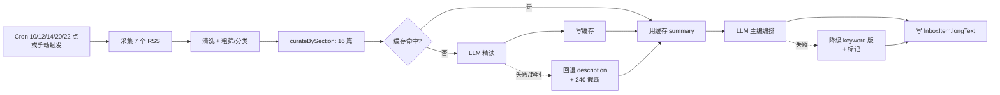

# 需求文档：信息摘要 2.0（Daily Digest 2.0-MVP）

## 1. 背景与目标

当前 Daily Digest 的 `summary` 字段是 RSS description 的 240 字符硬截断，缺"为什么重要"视角和整体编排，沦为"标题+简介列表"。2.0-MVP 引入 LLM 精读摘要 + 主编编排，配合系统设置页的 AI 配置持久化，输出真正的"日报"。**范围限定在摘要与配置两条主线；新源、推送、反馈回路留待 2.1/2.2/2.3。**

## 2. 功能需求（FR）

| 编号 | 需求描述 | 优先级 | 验收标准（当…时，系统应…） |
|------|----------|--------|---------------------------|
| FR-001 | AI 配置从 localStorage 迁到 DB：系统设置页保存到后端；启动时 DB 优先、env vars 兜底；提供"立即生效"端点热更新运行时 ChatClient | P0 | 填值→保存→刷新仍在；DB `app_config` 表可见；清空 DB 启动→配置来自 env；点击"立即生效"→下次 LLM 调用用新 key，无需重启 |
| FR-002 | 精读摘要：每篇入选文章（≤16）调用 LLM 输出结构化 JSON `{headline, tldr, detail, why_it_matters, source, url}`；按 `article.link` 缓存；单篇失败回退到 RSS description + 240 字符截断，digest 继续 | P0 | 评测集 `evals/summarize-golden.jsonl` ≥ 20 条真实文章：schema 字段填充率 100%；`why_it_matters` 长度 20-100 中文字符合格率 ≥ 85%；注入某篇 LLM 抛错→digest 仍 COMPLETED；同日 2 次 digest，第 2 次 LLM 调用次数 = 1 |
| FR-003 | 主编编排：所有精读就绪后对当日所有文章做一次 LLM 编排，输出总标题 + 2 句开场白 + 每个版面 3 句内导语 + 版面内按重要性排序；整批失败降级到当前 keyword 分类版本，summary 含"AI 摘要暂不可用"标记 | P0 | 3 天实测数据，输出含总标题/开场白/各版导语；评测方式见 `evals/editor-judge.md`；配错 API key 触发 digest→inbox 仍出现 keyword 分类版本 |
| FR-004 | 设置页增强：提供"测试连接"按钮（用当前 ChatClient 调一次，toast 反馈成功/失败）；显示当前生效配置来源（"数据库" / "环境变量"） | P1 | 点击测连→成功 toast 含模型名 / 失败 toast 含原因；DB 模式显示"数据库"，env 模式显示"环境变量" |

## 3. 非功能需求（NFR）

| 编号 | 需求 | 验收 |
|------|------|------|
| NFR-001 | 单次 LLM 调用 30s 超时，超时记 WARN 并按单篇失败处理 | mock 30s 延迟→30s 后记 WARN，回退到 description |
| NFR-002 | API key DB 加密存储（AES），加密密钥从 `app_config.crypto_key` 取 | DB dump 看不到明文；可解密还原 |
| NFR-003 | 单次 digest LLM 调用次数 ≤ 17（16 精读 + 1 编排，缓存命中不计） | 接入 LLM 调用计数器到 `DigestExecutionLog`，运行后断言 |
| NFR-004 | 评测集与评测脚本随代码同库（`docs/feature/digest-2.0/evals/`） | `mvn test -pl axis-service` 跑评测；G4 验收时跑 |

## 4. 范围外（Non-Goals）

- 不新增源（arXiv / HN / GitHub Trending / Google News RSS / RSSHub 留 2.1）
- 不做邮件 / TG / Webhook 推送（留 2.2）
- 不做日报存档页（留 2.2）
- 不做 👍/👎 反馈回路（留 2.3）
- 不动 `InboxItem` 表结构；不重建前端 Inbox 卡片（沿用 `longText` JSON 渲染）
- 不动 keyword 分类实现（保留作为降级路径）
- 不做跨源事件合并（embedding 聚类去重，留 2.3）
- 不做 cost 仪表盘（留 2.3）

## 5. 流程示意

## 6. 待确认问题

无（D1-D4 四个关键决策已按推荐默认值锁定：D1=DB 为主；D2=沿用 longText；D3=降级 keyword；D4=按 link 缓存）

## 变更记录

| 日期 | 变更内容 | 原因 |
|------|----------|------|
| 2026-07-22 | 初稿，锁定 D1-D4 四个决策为推荐默认值 | 2.0-MVP 启动 |
