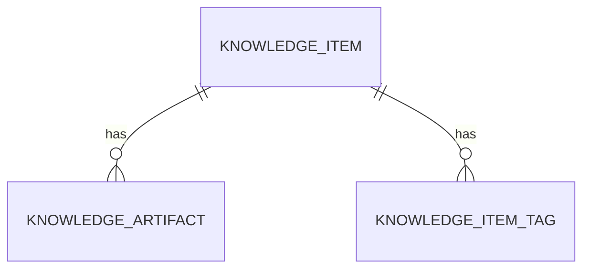
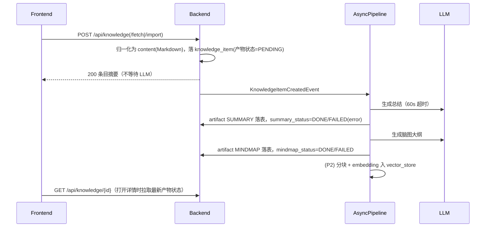

# 技术设计：知识库 2.0

<!-- 决策层：G1 逐字审，≤1 页 -->

## 1. 方案概述

**Source + Artifact 双表模型**：`knowledge_item` 主表存原文与元数据，`knowledge_artifact` 子表存 AI 派生产物（总结/脑图大纲，各带生成状态机）。三条摄取管线（粘贴/URL 抓取/文件导入）在后端统一落成 Markdown `content`，入库发 Spring 事件，`@Async` 管线调 LLM 生成两个产物。前端三栏 Linear 风布局，详情页 Tab 切换原文/总结/脑图（markmap 渲染 Markdown 大纲）。P2 加条目问答（复用 SSE 与 `chat_message`）与 pgvector 语义检索（缺扩展/embedding 失败自动降级关键词）。

关键取舍：
1. **Artifact 独立成表**而非主表宽列——产物可独立重试/重新生成，未来加转录、flashcard 不动主表
2. **脑图存 Markdown 大纲**而非 JSON——一份内容同时喂 markmap 和文字大纲视图
3. **抓取/解析放后端**——无 CORS 问题，三条管线产物归一，前端零解析负担
4. **旧模块直接废弃重建**（删旧表旧代码）——项目无线上包袱（AGENTS.md 明确允许），不留兼容层
5. **检索降级优先可用性**——pgvector/embedding 不可用时关键词检索兜底，不阻塞主流程

## 2. 影响面

| 类型 | 位置 | 改动方式 |
|------|------|----------|
| 删除 | `axis-service` 旧 `KnowledgeController/Service/Repository/entity/KnowledgeDocument` | 整体删除，由新包替代 |
| 删除 | DB 旧表 `knowledge_document` | 实现时本地手动 DROP 一次（无迁移脚本约定） |
| 新增 | `axis-service` `knowledge/` 包（entity/repository/service/controller/pipeline） | 新建 |
| 新增依赖 | `axis-service/pom.xml`：jsoup、flexmark-html2md-converter、pdfbox、spring-ai pgvector store；test-scope `spring-boot-data-jpa-test`（变更记录 2026-08-03） | 新增 |
| 修改 | `AiConfigService` | 增加 `getEmbeddingModel()`，与 ChatClient 同配置源 |
| 修改 | `axis-agent` `KnowledgeTool` | 三个方法重写（检索走向量/降级、创建走新管线）= 接口契约变更，本设计覆盖 |
| 修改 | `InboxService` | 复用标已读逻辑供 from-inbox 调用 |
| 删除/重建 | 前端 `pages/knowledge.vue` → `pages/knowledge/index.vue` + `components/knowledge/` | 重建 |
| 修改 | 前端 `layouts/default.vue`、`CommandPalette.vue`、`pages/index.vue`(Inbox) | 导航/命令/「转入知识库」入口 |
| 新增依赖 | `frontend/package.json`：markmap-lib、markmap-view；shadcn-vue `tabs` 组件 | 新增 |
| 新增 | `docs/feature/knowledge-2.0/evals/` | 评测集与脚本 |

---

> **细节层（实现参考，审阅可选）**：标准是实现时不再有歧义。

## 3. 数据模型

**`knowledge_item`**

| 字段 | 类型 | 说明 |
|------|------|------|
| id | varchar(30) PK | 沿用现有 cuid 风格生成 |
| type | enum 字符串 | `ARTICLE`/`BOOK`/`PODCAST`/`VIDEO`/`TUTORIAL`/`NOTE`（本期只用 ARTICLE/BOOK/NOTE，其余预留） |
| title | varchar(500) not null | |
| content | text not null | 原文 Markdown，所有产物唯一源头 |
| source_url | varchar(2048) null | |
| file_path | varchar(512) null | 上传文件相对路径 |
| status | enum 字符串 | `UNREAD`/`READING`/`DONE`/`ARCHIVED`，默认 UNREAD |
| progress | int not null default 0 | 0–100 |
| summary_status / mindmap_status | enum 字符串 | `PENDING`/`GENERATING`/`DONE`/`FAILED`，默认 PENDING |
| created_at / updated_at | timestamp | `@CreationTimestamp`/`@UpdateTimestamp` |

**`knowledge_artifact`**：`id`、`item_id`(ManyToOne)、`kind`(`SUMMARY`/`MINDMAP`)、`content` text、`model` varchar、`error` varchar(1000) null、`created_at`/`updated_at`。`item_id+kind` 唯一。

**`knowledge_item_tag`**:`@ElementCollection`，`item_id` + `tag` varchar(50)。

**`knowledge_chunk`（P2）**：由 Spring AI PgVectorStore 管理的 `vector_store` 表（content + metadata{item_id, type} + embedding vector(1536)），不自建。

## 4. 接口设计

均在 `/api/knowledge` 下，请求/响应 DTO 用 record，Controller 只做装配+委托，Bean Validation 把关。

| 方法 | 路径 | 说明 | 对应 FR |
|------|------|------|---------|
| GET | `/api/knowledge?type=&status=&tag=&q=` | 列表（不含 content，含产物状态） | FR-005 |
| GET | `/api/knowledge/{id}` | 详情（含 content + artifacts） | FR-006 |
| POST | `/api/knowledge` | 粘贴创建 `{type,title,content,sourceUrl?,tags?}` | FR-001 |
| POST | `/api/knowledge/fetch` | `{url}` → 抓取创建 | FR-002 |
| POST | `/api/knowledge/import` | multipart 文件导入 | FR-003 |
| POST | `/api/knowledge/from-inbox` | `{inboxItemId}` | FR-008 |
| PATCH | `/api/knowledge/{id}` | title/status/progress/tags 部分更新 | FR-007 |
| DELETE | `/api/knowledge/{id}` | 删除（级联产物） | FR-005 |
| POST | `/api/knowledge/{id}/artifacts/{kind}/regenerate` | 重试/重新生成 | FR-004 |
| POST | `/api/knowledge/{id}/chat` | SSE 问答（P2） | FR-009 |

错误语义：400 参数校验（Bean Validation）；404 条目不存在；415 不支持的文件类型；422 `FETCH_FAILED`/`EXTRACT_FAILED`；LLM 故障不反映到摄取接口（异步，体现在产物状态）。统一错误体沿用项目现有风格。

## 5. 核心流程

前端状态管理沿用 `useLocalFirst` + `useOptimistic`：列表首屏走 localStorage 缓存、后台同步；产物状态在详情打开时与重试后刷新。

## 6. AI 设计

**Prompt（视同接口契约，改动需 M 级以上确认）**

- 总结 prompt 要点：角色=技术编辑；输入=标题+正文（截断标注）；输出=固定三节 Markdown（TL;DR / 要点 3–7 条 / 关键洞察 1–3 条）；语言跟随原文（中文优先）；禁止编造原文没有的事实
- 脑图 prompt 要点：输出仅 Markdown 标题层级（H1=中心主题，层级 ≤4，节点为短句 ≤20 字，节点总数 5–40）；不要正文段落、不要代码块包裹
- 问答 system prompt 要点：注入标题+总结+原文（截断）；只依据所给内容回答，超出则明说「原文未提及」；不挂 Tool

**工具变更（KnowledgeTool，接口契约）**

- `createDocument(title, content)` → 走新创建管线（type=NOTE，触发异步加工）
- `listDocuments()` → 不变（标题+id 列表）
- `searchDocuments(keyword)` → 语义检索 top-5（标题+摘要+item_id）；向量不可用降级关键词；描述文案同步更新

**护栏与降级**：LLM 60s 超时；产物失败标 FAILED 不阻塞摄取；pgvector 扩展缺失/embedding 失败 → 关键词检索 + WARN；问答不挂工具、无写操作；无危险动作豁免需求。

**Embedding**：`AiConfigService.getEmbeddingModel()` 复用激活档案 base-url/key，模型默认 `text-embedding-3-small`（配置项可覆盖）；分块 ~1000 字符重叠 100。

**评测**：`evals/summary-golden.jsonl`（≥10 篇真实文章，含字段：url/title/content）；评测入口仿 `SummarizationEval`；脑图合法性脚本判定；问答 `evals/qa-golden.jsonl` ≥5 条，judge 判定答案源自原文。阈值见 requirements NFR-004/005。

## 7. 前端设计

- 路由：`pages/knowledge/index.vue` 三栏：左栏（类型/状态/标签导航，`ScrollArea`）、中栏条目列表（类型图标+标题+状态徽章+进度条+两产物状态点）、右栏详情
- 详情：头部标题/元信息/状态切换/标签编辑；Tab（shadcn-vue `tabs`，新增）切换 原文（`MarkdownRenderer`)/总结/脑图（markmap，工具条可切「脑图/大纲」）；产物 GENERATING 显示骨架屏、FAILED 显示重试按钮；右侧可开合 AI 问答面板（P2，复用 chat 帧协议渲染）
- 添加入口：页面头「+ 添加」→ `Dialog` 三 tab（粘贴/URL/上传）；⌘K 命令「Add to Knowledge」同入口
- Inbox：条目操作菜单加「转入知识库」，成功后 toast + 该条目标已读
- 进度：原文视图滚动 2s 防抖 PATCH progress；打开详情按 progress 恢复滚动位置

## 变更记录

| 日期 | 变更内容 | 原因 |
|------|----------|------|
| 2026-08-03 | 初稿 | 2.0 立项 |
| 2026-08-03 | 影响面新增 test-scope 依赖 `spring-boot-data-jpa-test`（含测试用最小 `@SpringBootConfiguration` 配置类），用于 `KnowledgeItemRepository.search` 的 `@DataJpaTest` 集成测试 | T-002 任务审查发现 search JPQL 语义零自动化覆盖；Spring Boot 4 将测试切片拆为独立模块，不加依赖无法编译；用户已确认此变更点 |
| 2026-08-04 | 脑图 prompt（`KnowledgePrompts.PROMPT_MINDMAP`）强化节点数约束：5-40 改为「严格控制……超出即不合格」并给合并/补足指引；补充「H1 恰好一个且为第一行」「无论文章长短必须输出大纲」「不输出解释或注释」 | T-006 首轮全量评测脑图合格率 6/9：长文节点超标（55/60 个）、超短文未输出任何标题；按 T-006 简报授权迭代 prompt 后重跑 |
| 2026-08-04 | 总结 prompt（`KnowledgePrompts.PROMPT_SUMMARY`）补充「三节缺一不可，即使原文简短关键洞察也必须保留至少 1 条」 | T-006 次轮全量评测结构合格率 9/10：en-02 短文缺失「关键洞察」节；按 T-006 简报授权迭代 prompt 后重跑 |
| 2026-08-04 | from-inbox 转入逻辑改三路分流：`KnowledgeService.createFromInbox` 在 content 非 URL 时检查条目 `link`，合法 http(s) URL 则走抓取管线（DIGEST 条目 URL 在 link、content 只存标题） | T-007 审查发现 DIGEST 条目 URL 在 link 字段，原逻辑只产出标题壳 NOTE |
| 2026-08-04 | 已知接受风险登记（本地单人威胁模型）：①抓取/粘贴内容经 marked v-html 渲染无消毒（XSS 面，修法 DOMPurify 或 jsoup Safelist，留 backlog）；②/api/knowledge/fetch 与 from-inbox 无 SSRF 防护（可抓内网/元数据地址，修法解析后校验 InetAddress 拒私网段，留 backlog）；③include-message:always 与 multipart 20MB 为全局生效，外溢至既有端点 | 终审安全审查结论，项目未上线暂不阻断 |
| 2026-08-06 | §6 Embedding 行「分块 ~1000 字符重叠 100」被取代：分块算法升级为清洗 + 递归句边界切分（≤500 token、重叠取整句 ≤50 token、标题前置），见 `docs/feature/knowledge-chunking/lite-spec.md` | chunker P0 实施完成，本文参数描述过时 |
