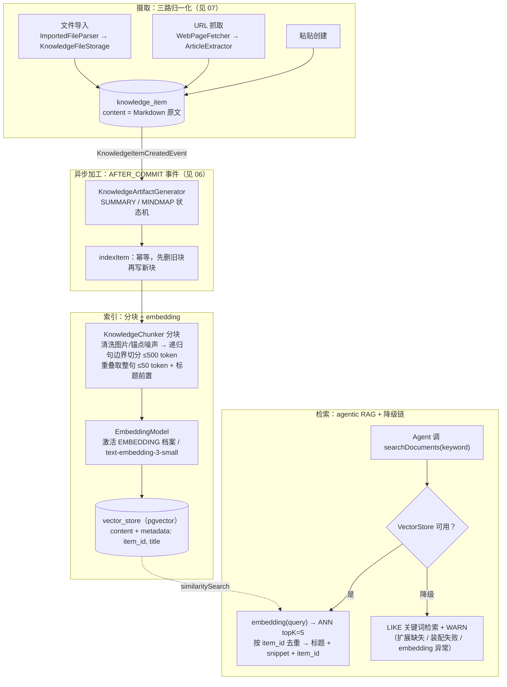

# RAG 架构：从原理到本项目实践

> RAG（Retrieval-Augmented Generation，检索增强生成）= **生成前先检索，把检索结果塞进 prompt 作为回答依据**。一句话记忆：把 LLM 从「闭卷背诵」变成「开卷考试」。

---

## 1. RAG 解决什么问题

| 问题 | 没 RAG 时 | 有 RAG 时 |
|---|---|---|
| 知识截止 | 模型只知道训练数据里的世界 | 检索最新文档注入，知识即数据 |
| 私有/领域知识 | 你的笔记、内部文档模型从没见过 | 检索你的语料注入，模型「看过」了 |
| 幻觉 | 没依据也会自信地编 | prompt 要求只依据检索内容回答 + 可溯源引用 |

### 与微调的分界（高频考点）

- **微调改的是权重**：成本高、周期长、新知识要重训、可能灾难性遗忘
- **RAG 改的是上下文**：知识以数据形式存在，可增删改查、即时生效、可引用溯源
- 选型原则：**知识类需求用 RAG；风格/格式/能力类需求才考虑微调**

## 2. 标准管线：两个阶段

```
索引阶段（写时）                         检索阶段（读时）
文档 ─→ Load(摄取解析)                  用户问题
     ─→ Split(分块)                        │ Embed（同一模型！）
     ─→ Embed(向量化)                      ▼
     ─→ Store(向量库+元数据)      Search(ANN 近似最近邻 topK)
                                        │ (可选 Rerank 重排)
                                        ▼
                              Augment(拼入 prompt：依据 + 拒答指令)
                                        ▼
                              Generate(LLM 基于检索内容生成)
```

每个环节的决策点：

| 环节 | 关键决策 | 权衡 |
|---|---|---|
| Split | 块大小 / 重叠 / 定长 vs 按结构（标题、段落） | 太大稀释主题、太小断义；重叠防跨边界切断 |
| Embed | 模型维度 / 多语言 / 成本 | 索引与检索**必须同一模型**，否则向量空间错位 |
| Store | pgvector / Qdrant / Milvus / 专用库 | 数据规模 + 运维成本 + 与业务数据的事务一致性 |
| Search | topK / 纯向量 vs BM25 vs hybrid | K 小漏检、K 大噪声与成本；hybrid 兼顾语义与精确词 |
| Rerank | 初检多取（top 20）→ 交叉编码器重排 → 取 top 5 | 加一次模型调用换精度，延迟敏感可省 |
| Augment | 注入位置 / 引用标记 / 拒答指令 | 塞太多块会「lost in the middle」（模型忽略中段） |

## 3. 三种形态演进

1. **Naive RAG**：上述朴素管线，一次检索一次生成
2. **Advanced RAG**：query 改写（用户口语→检索友好表达）、hybrid 融合检索、rerank、metadata 预过滤
3. **Modular / Agentic RAG**：检索不再是固定管线，而是 **Agent 的一件工具**——由模型自己决定何时检索、检索什么、检索几次。本项目的 `KnowledgeTool` 就是这个形态（见 §5）

## 4. 常见失败模式（面试加分项）

- **检索不到**：分块烂 / embedding 弱 / query 与文档措辞差异大 → query 改写、hybrid
- **检索到了但没用上**：塞块过多，模型忽略中间段（lost in the middle）→ 控 topK、rerank
- **照样幻觉**：prompt 没有「只依据检索内容+拒答」指令，且无评测钉住 → 见 §4 评估
- **索引腐烂**：文档改了删了，向量没同步 → **索引生命周期管理**（更新重建、删除清理）是必做项不是优化项

## 5. 评估

- **检索质量**：hit rate（语义相近词能否命中目标块）/ MRR
- **生成质量**：faithfulness（答案是否忠于检索内容，judge 判定）+ 超纲拒答率
- 方法：golden QA + LLM-judge + fail-closed 断言——与 `08-llm-engineering-eval-degradation.md` 同一套评测哲学

---

## 6. 本项目实践（Axis 知识库）

本项目里 RAG 思想以**两种不同形态**落地，且第二种恰恰是「有意不用 R」——这个辨析是理解 RAG 适用边界的最佳案例。

### 全链路一张图（摄取 → 加工 → 索引 → 检索）



图中未画边的两条规则：**索引生命周期**——条目删除走 `removeItem` 按 `item_id` filter 清向量（防索引腐烂）；条目内容更新由 `indexItem` 幂等重建（分块算法/embedding 变更后走 `POST /api/knowledge/reindex` 全量重建）。分块算法的实测依据见 `docs/feature/knowledge-chunking/lite-spec.md`。

### 用法一：Agent 语义检索（agentic RAG 形态）

```
Agent 对话中模型决定调 searchDocuments(keyword)
  → KnowledgeSearchService（Vector 实现）
  → embedding(query) → pgvector ANN topK=5
  → 返回 [标题 + snippet(~200字) + item_id] 给模型组织回答
```

- 索引侧：条目创建后经异步管线**分块（清洗图片/锚点噪声 → 递归句边界切分 ≤500 token，重叠取整句 ≤50 token，标题前置进嵌入文本）** → embedding → `PgVectorStore`（metadata 带 `item_id`）
- **索引生命周期**：条目删除按 `item_id ==` filter 清向量（防索引腐烂）；重建入口幂等备妥
- **降级**：扩展缺失/装配失败/embedding 失败三层降级到关键词检索（见 08 文档）
- 这是 agentic RAG：**检索是 Agent 的工具，何时搜由模型判断**，而非固定管线

### 用法二：条目问答（有意不用 R：long-context grounding）

详情页问答**不是 RAG**：语料 = 单篇文档（≤100k 字符）且上下文装得下，于是把**整篇原文+总结直接注入 system prompt**，不做检索。

判断准则（值得背）：

> **语料远大于上下文窗口时，才需要 R（检索做减法）；语料装得下时，检索是多余的——它只会引入漏检风险，不会带来收益。**

单文档 QA 场景下，整篇注入让模型看到 100% 原文，比 topK 检索更可靠；代价仅是 token 成本，单文档量级可接受。

### 本项目各环节选择 vs 业界常见选择

| 环节 | 本项目 | 业界常见 | 理由 |
|---|---|---|---|
| 分块 | ≤500 token 递归切分（段落→句末），重叠取整句 ≤50 token；清洗图片/锚点噪声 + 标题前置 | 250~500 token，按结构 | golden 集实测：坏边界率 96%→1.2%，近噪声块 5→0（knowledge-chunking） |
| Embedding | text-embedding-3-small（可配） | 同左 / bge 系开源 | 复用 AI 档案零新成本；中文敏感场景可换 bge |
| 向量库 | pgvector（复用 PG） | Qdrant/Milvus | 几千块全表距离毫秒级；与业务数据同事务；零新组件 |
| topK | 5 | 3~10 | Agent 场景宁缺毋滥 |
| Rerank | 未做 | 交叉编码器 | 语料小，先观察命中率再补 |
| Hybrid | 未做（向量 or 关键词二选一降级） | RRF 融合 | 演进方向 |
| 引用 | snippet 原文返回 Agent，答案未带逐句引用 | 引用标注 | 演进方向 |
| 检索质量评测 | `KnowledgeVectorSearchEval`（语义近义词命中 + 图文混排细节查询，门控） | hit rate/MRR | 2026-08-06 已复验通过（B-003 关闭） |

## 7. 面试问答速记

**Q：RAG 是什么，解决什么问题？**
A：生成前先检索并把结果注入 prompt，解决知识截止、私有知识、幻觉三类问题——开卷考试 vs 闭卷背诵。

**Q：为什么不用微调？**
A：知识类需求用 RAG（数据可增删改查、即时生效、可溯源）；微调改权重，适合风格/能力类需求，知识更新要重训还会遗忘。

**Q：分块怎么设计？**
A：三个约束——太大稀释主题、太小断义、模型有上限；重叠防跨边界切断；能按结构（标题/段落）就优先按结构，定长是稳妥底线。

**Q：向量库怎么选？**
A：看规模与运维：几千~几万块 pgvector 足够（全表距离毫秒级，与业务库同事务）；百万级以上或对延迟敏感再考虑 Qdrant/Milvus 专用库。

**Q：有了 RAG 还有幻觉吗？怎么评？**
A：有——检索不到、lost in the middle、模型无视检索内容都会幻觉。评估分检索质量（hit rate）与生成质量（faithfulness，judge），超纲拒答样例计入通过率。

**Q：你的项目里 RAG 怎么用的？**
A：两种形态——Agent 全局检索是 agentic RAG（检索是工具，分块 ≤500 token 句边界递归切入 pgvector，三层降级）；条目问答有意不用 R，因为语料是单文档且装得下上下文，整篇注入比 topK 更可靠。**能讲清「什么时候不需要 RAG」比会搭 RAG 更见功底。**

## 变更记录

| 日期 | 变更内容 | 原因 |
|------|----------|------|
| 2026-08-04 | 初稿 | 知识库 2.0 复盘系列第 5 讲沉淀，用户要求 RAG 科普 + 项目对照 |
| 2026-08-06 | §6 增补全链路 mermaid 架构图（摄取→加工→索引→检索），标注 chunker P0 优化落点 | chunker 优化讨论（现 `docs/feature/knowledge-chunking/lite-spec.md`）中发现缺端到端单图，各段图散落在 05/06/07/09 |
| 2026-08-06 | 分块参数全面更新为 knowledge-chunking 落地结果（递归句边界切分 ≤500 token / 清洗 / 标题前置），含 reindex 入口说明 | chunker P0 实施完成并验证，文档与代码同步 |
